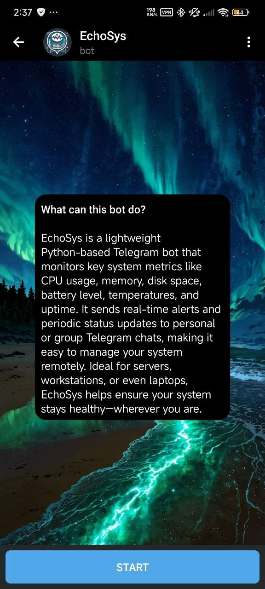
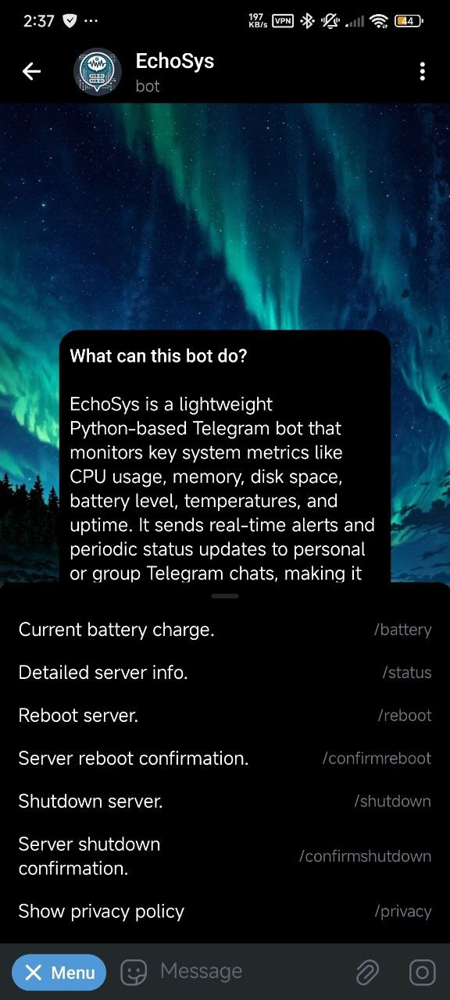
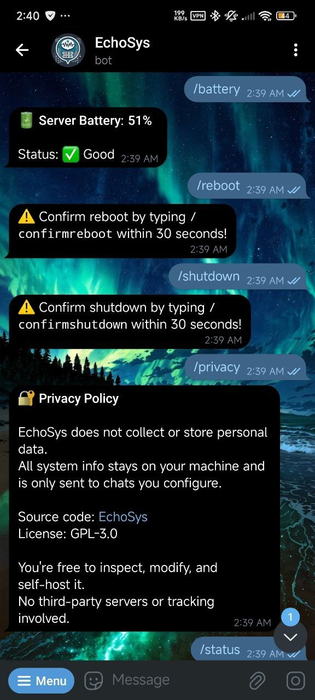
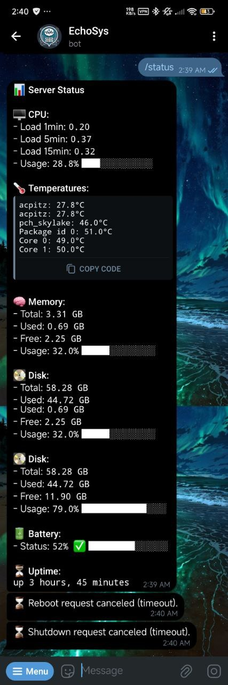

# EchoSys

<p align="center">
  
</p>

<p align="center">
  
  
  
</p>

EchoSys is a lightweight Python-based Telegram bot designed to monitor and remotely manage the health of a Linux system or server. It reports on system resources like battery level, CPU usage, memory, disk, and temperature, and also supports remote commands such as shutdown and reboot via Telegram.

---

## ✨ Features

- 🔋 Battery level monitoring and alerts at 10%, 5%, 2%, and critical 1%
- 📊 Full system status report including:
  - CPU load and usage
  - RAM usage
  - Disk usage
  - Temperature sensors
  - Uptime
- 📡 Remote command support through Telegram:
  - Secure and confirmed shutdown/reboot commands
- 🌐 IPv4 enforcement for network requests
- ⏱️ Configurable check intervals
- 🛠️ Systemd service integration for persistence

---

## 🧾 Commands Overview

| Command              | Description                          |
|----------------------|--------------------------------------|
| `/battery`           | Check current battery level          |
| `/status`            | Get a full system health report      |
| `/shutdown`          | Initiate shutdown (requires confirm) |
| `/confirmshutdown`   | Shutdown confirmation                |
| `/reboot`            | Initiate reboot (requires confirm)   |
| `/confirmreboot`     | Reboot confirmation                  |
| `/privacy`           | Show privacy policy                  |

---

## 🧰 Requirements

- Python 3.10+
- Telegram bot token (via [@BotFather](https://t.me/BotFather))
- Your Telegram user and/or group chat IDs

### 📦 Install Python dependencies

```bash
pip install -r requirements.txt
```

Your `requirements.txt` should include:

```
dotenv
psutil
requests
```

---

## 🔐 Environment Variables

Create a `.env` file in the project root with the following content:

```env
BOT_TOKEN=your_telegram_bot_token
BOT_USERNAME=your_bot_username (without @)
PERSONAL_CHAT_ID=your_telegram_user_id
GROUP_CHAT_ID=your_group_chat_id
```

> **⚠️ Never commit your `.env` file to version control!**  
> Make sure to add `.env` to your `.gitignore`.

### Example `.env` (do not share this file publicly)

```
BOT_TOKEN=123456789:ABCDEF-your-bot-token
BOT_USERNAME=placeandholderbot
PERSONAL_CHAT_ID=987654321
GROUP_CHAT_ID=-1234567890
```

---

## 🚀 Running the Bot

### ✅ Allow shutdown and reboot without password

Make sure your user has permission by editing the sudoers file with `sudo visudo` and adding:

```
yourusername ALL=NOPASSWD: /sbin/shutdown, /sbin/reboot
```

### 🧪 Development mode

Run the bot manually:

```bash
python3 echosys.py
```

---

## 🛠️ Running as a systemd service (Linux)

To keep the bot running persistently:

1. **Create a systemd service file:**

```ini
# /etc/systemd/system/echosys.service

[Unit]
Description=EchoSys Telegram Bot - Description you want to add
After=network.target

[Service]
User=your_linux_username
ExecStart=/usr/bin/python3 /path/to/your/bot/script.py
Restart=always
EnvironmentFile=/path/to/your/file/.env

[Install]
WantedBy=multi-user.target
```

> Replace paths and usernames with actual values on your system.

2. **Reload systemd and enable the bot service:**

```bash
sudo systemctl daemon-reload
sudo systemctl enable --now echosys
```

3. **Check the service status:**

```bash
sudo systemctl status echosys
```

---

## 📸 Sample Output

Here’s how the bot outputs information in a Telegram chat:



---

## 🔐 Security Notes

- 🔒 **Keep your Telegram bot token and chat IDs secure.**
- 🚫 **Never hard-code secrets in public repositories.**
- 🌱 **Use environment variables or external config files in production environments.**

> 🛡️ **Keeping your credentials safe ensures your bot remains under your control.**

---

## 🤝 Contributing

Feel free to fork the project and submit a pull request! 🛠️  
Feature suggestions, improvements, and bug fixes are always welcome! 💡🐛  
Let’s make this better together. 🚀

---

## 👨‍💻 Author

Made with ❤️ by [FelipheMP](https://github.com/FelipheMP)

---

## 📄 License

GPL-3.0. See [LICENSE](./LICENSE) for more details.
